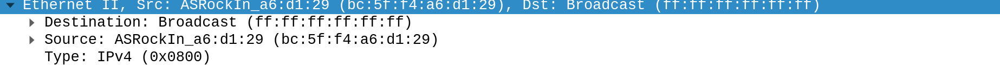
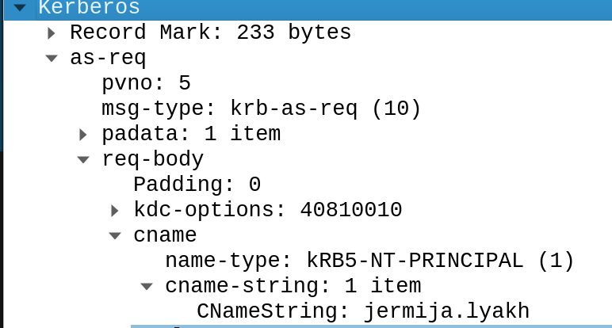
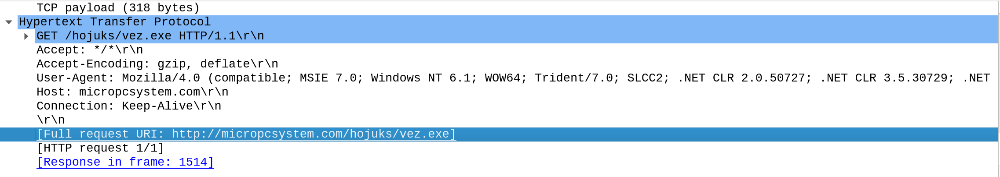
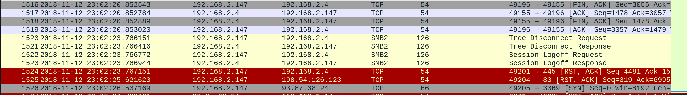
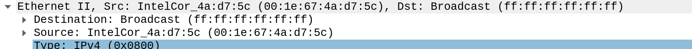
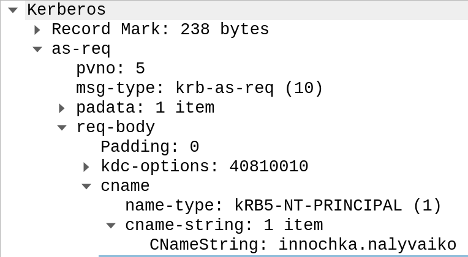
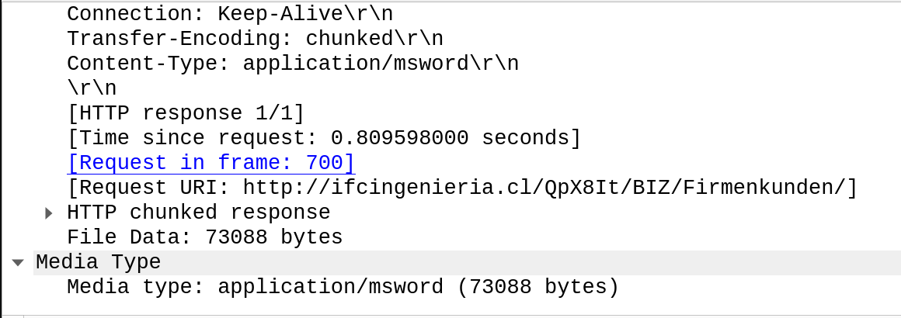
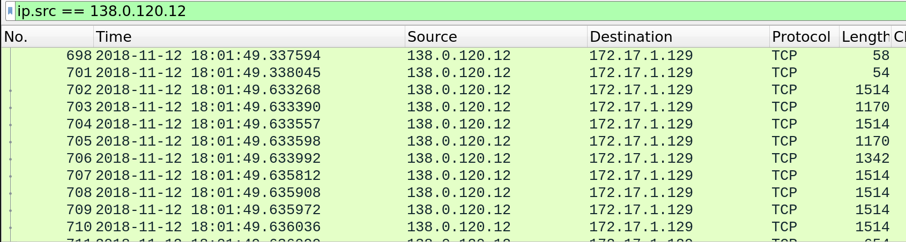
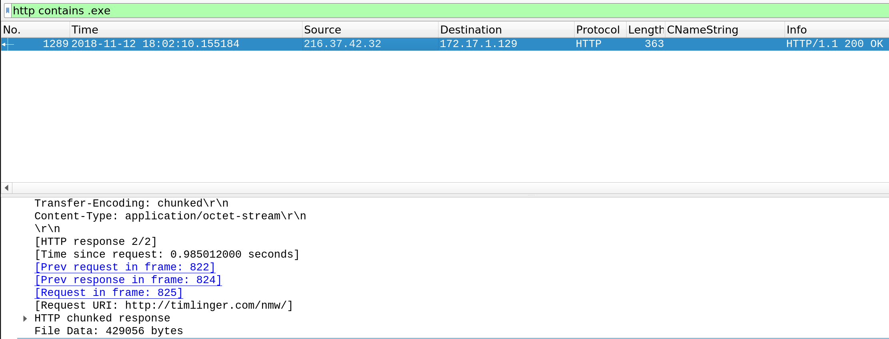

# TecHack Roteiro 1
### Por Victor Vergara

1) Um dos IDSs mais famosos é o McAfee Network security Platforms, focado para empresas, ele bloqueia downloads e sites maliciosos, protege de ataques DDoS além de enctiptar os dados da sua rede. Outro grande é o OSSEC, considerado um dos melhores open-source.

2) O IDS (Intrusion Detection Systems) aniliza e monitora a rede para ataques comparando o tráfego com ataques conhecidos, checando políticas de segurança, scaneando por malwares e checando as portas do sistema, já o IPS(Intrusion Prevention Systems) serve como uma barreira entre a rede externa e interna, bloqueando conexões suspeitas.
Muitas vezes os 2 sistemas são vendidos juntos no mesmo serviço.

### Desafio1

3) bc:5f:f4:a6:d1:29

4) Lyakh-Win7-PC

5) jermija.lyaki

6) O protocolo Kerberos é utilizado para fazer uma autentificação mutua entre um cliente e se um servidor em redes não seguras

7) http://micropcsystem.com/hojuks/vez.exe

8) A request foi feita as 23:02:13 no dia 12/11/2018 e foi recebida 23:02:15 no dia 12/11/2018

9) 93.87.38.24

### Desafio2

10) 00:1e:67:4a:d7:5c

11) Nalyvaiko-PC

12) innochka.nalyvaiko

13) http://ifcingenieria.cl/QpX8It/BIZ/Firmenkunden/

14) A primeira conexão foi feita as 18:01:29 no dia 12/11/2018 #####

15) http://timlinger.com/nmw/

