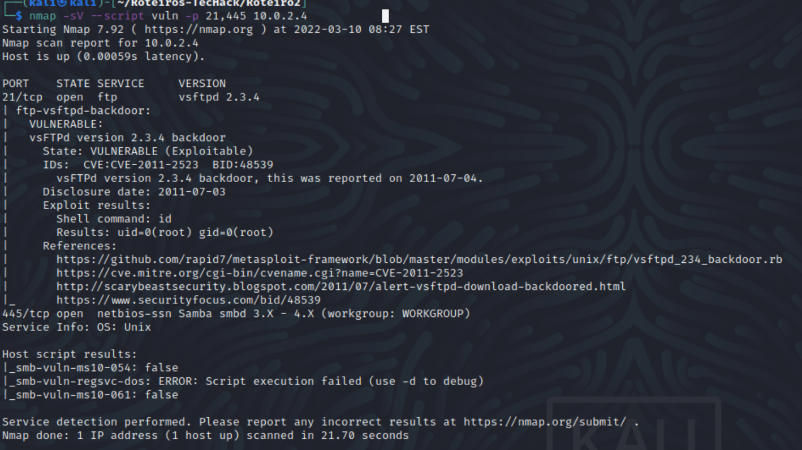

# TecHack Roteiro 2
### Por Victor Vergara

#### 1) 

1.1a)

10.0.2.4

1.1b)

1.1c) 

nmap -O 10.0.2.4

1.1d) 

Arquivo portScanner.py

1.1e) 

1.1f) 

Exploit encontrado na Porta 21

1.1g) 

Na porta 3306 foram encontrados 2 CVEs classificados como altos:

CVE-2009-2446   8.5     https://vulners.com/cve/CVE-2009-2446

CVE-2008-0226   7.5     https://vulners.com/cve/CVE-2008-0226

Na porta 5432 foram encontrados 2 CVEs classificados como Crítico:

CVE-2013-1903   10.0    https://vulners.com/cve/CVE-2013-1903

CVE-2013-1902   10.0    https://vulners.com/cve/CVE-2013-1902

Também foram encontrados 4 CVEs classificados como Altos:

POSTGRESQL:CVE-2013-1900        8.5     https://vulners.com/postgresql/POSTGRESQL:CVE-2013-1900

POSTGRESQL:CVE-2010-1169        8.5     https://vulners.com/postgresql/POSTGRESQL:CVE-2010-1169

CVE-2010-1447   8.5     https://vulners.com/cve/CVE-2010-1447

CVE-2010-1169   8.5     https://vulners.com/cve/CVE-2010-1169

1.1h) 

a) 104.16.44.99

b) CloudFlare, mostrado no comando acima e no abaixo

c) Sim, há um servidor de email no domínio: mail.ietf.org no IP 4.31.198.44 

Os dados foram pegos utilizando o site IPOk (https://ipok.com.br/tools.php?valor=ietf.org&tool=info) e NetCraft(https://sitereport.netcraft.com/?url=mail.ietf.org)

1.1i) 

a) Site escolhido: www.rodolfoavelino.com.br

b) Sim é um IP do CloudFlare, assim é utilizado por vários outros serviços.
Esses podem ser encontrados fazendo um reverse IP Lookup (https://hackertarget.com/reverse-ip-lookup/ utilizando o IP 104.21.57.232)

c) Via o nmap -O não é possível ter certeza do OS, ele acredita ser o British Gas GS-Z3 data logger

Mas ao pingar o site, o ttl é de 52, indicando ser linux.

Ao olhar no seu histórico de Hospedagem é possível ver que o servidor roda Linux com Apache.

d) 

e)Sim, CloudFlare e Wordfence

f) Sim:

rodolfoavelino.com.br.	300	IN	MX 10	mail.rodolfoavelino.com.br

1.1j) 

Um dos CVEs comum é CVE-2018-10070 com rating de 7.5 onde é enviado uma FTP request com vários "/0" impossibilitando de receber novas requests FTP e fazendo o router fazer um reboot em 10 minutos.

https://nvd.nist.gov/vuln/detail/CVE-2018-10070

Outro é o CVE-2019-19296 com rating de 8.1, que em servers SiVMS/SiNVR Video Server onde um usuário qualquer pode baixar arquivos do servidor

https://nvd.nist.gov/vuln/detail/CVE-2019-19296
